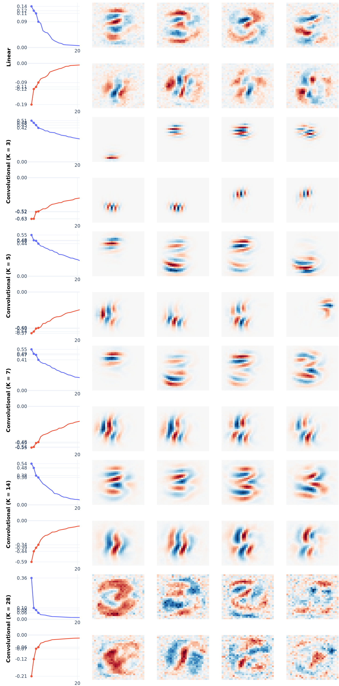

# Weight-based bilinear convolutional model analysis

This code is an extension of the code and work of [[link](https://github.com/tdooms/bilinear-decomposition)].
This later work analyses a bilinear MLP using a weight-based approach. It does so by analysing the spectra of the bilinear MLP weights using eigendecomposition. We extend this work by analysing a bilinear convolutional model. 

<div align="center">
  
</div>

## File structure

```
bilinear_decomposition/
├── image/                    # model and plotting code, this folder comes from the work we extend. We only extended this code to add the bilinear convolutional model.
  └── model.py                # the bilinear MLP and bilinear convolutional model definition.
  └── datasets.py             # Dataset wrapper for MNIST.
  └── plotting.py             # eigenspectrum and instance-based explanaibility plots.
├── shared/                   # shared model components
  └── components.py           # contains the shared components of the models.
├── pictures/                 # all plots generated by the code (eigenspectra, per-class convolutional and linear
  weight visualizations, and instance-based explanations).
├── analysis.ipynb            # Jupyter Notebook running the weight-based analysis of the convolutional model.
├── sweep_kernel_results.csv  # results of the kernel-size hyperparameter sweep.
├── pyproject.toml            # dependecy declaration
├── uv.lock                   # lockfile
```

## Usage

Run the weight-based analysis by opening `analysis.ipynb` and selecting the project's virtual environment
kernel in VSCode.

## Requirements

Dependencies are declared in [`pyproject.toml`](pyproject.toml). Install [uv](https://docs.astral.sh/uv/getting-started/installation/), then execute in the `bilinear_decomposition/` folder

```bash
uv sync
```

This creates a virtual environment and installs all dependencies:
- `Python` >= 3.12
- `torch`
- `torchvision`
- `einops`
- `transformers`
- `jaxtyping`
- `pandas`
- `datasets`
- `wandb`
- `accelerate`
- `bidict`
- `nnsight`
- `kornia`
- `plotly`
- `ipykernel`
