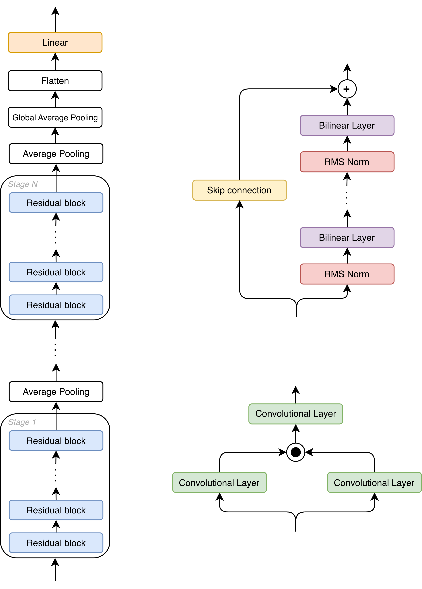

# Convolutional Neural Networks to Tensor Networks

This repository contains the code to build, train, and convert a newly proposed CNN
architecture into an equivalent tensor network. The architecture and the conversion method
are described in the accompanying master's thesis.

The proposed architecture is illustrated below. It is a multi-stage deep residual CNN built
entirely from components individually convertible to an equivalent tensor network.

<div align="center">
  
</div>

## File structure

```
cnn_to_tn/
├── utils/                        # building blocks, assembled model, training loop, W&B sweeping
  └── BilinearLayer2d.py          # Bilinear convolutional layer implementation
  └── model.py                    # Code implementing the proposed architecture
  └── ResidualBlock.py            # Code implementing the residual block
  └── train.py                    # Code implementing the training pipeline of the proposed model
  └── tuning.py                   # Code implementing the hyperparametertuning logic
  └── wandbai.py                  # Code containing wandb connecting logic
├── mnist/                        # build/train/test on MNIST
  └── mnist_model.py              # Model definition for MNIST
  └── setup_mnist.py              # Code to download the MNIST dataset
  └── train_mnist.py              # Code used for the hyperparameter selection on the MNIST dataset
  └── test_mnist.py               # Code to test a configuration on the complete MNIST dataset
  └── sweep.yaml                  # sweep file defining the config to test for MNIST
├── cifar_10/                     # build/train/test on CIFAR-10
  └── cifar_10_model.py           # Model definition for CIFAR-10
  └── setup_cifar10.py            # Code to download the CIFAR-10 dataset
  └── train_cifar10.py            # Code used for the hyperparameter selection on the CIFAR-10 dataset
  └── test_cifar_10.py            # Code to test a configuration on the complete CIFAR-10 dataset
  └── sweep.yaml                  # sweep file defining the config to test for CIFAR-10
├── cifar_100/                    # build/train/test on CIFAR-100
  └── cifar_100_model.py          # Model definition for CIFAR-100
  └── setup_cifar100.py           # Code to download the CIFAR-100 dataset
  └── train_cifar100.py           # Code used for the hyperparameter selection on the CIFAR-100 dataset
  └── test_cifar_100.py           # Code to test a configuration on the complete CIFAR-100 dataset
  └── sweep.yaml                  # sweep file defining the config to test for CIFAR-100
├── SVHN/                         # build/train/test on SVHN
  └── svhn_model.py               # Model definition for SVHN
  └── setup_svhn.py               # Code to download the SVHN dataset
  └── train_svhn.py               # Code used for the hyperparameter selection on the SVHN dataset
  └── test_svhn.py                # Code to test a configuration on the complete SVHN dataset
  └── sweep.yaml                  # sweep file defining the config to test for SVHN
└── converter/                    # tensor-network conversion, equivalence tests, scalability experiment
  └── convert.py                  # Contains the conversion logic code and pipeline
  └── test_convert.py             # Contains testing code of the conversion logic
  └── scalability_experiment.py   # Contains the code of the conversion accuracy experiment from the master's thesis
```

## Usage

All commands are run from inside the `cnn_to_tn/` folder.

Training logs to a Weights & Biases project, so a W&B API key must be available in the
`API_KEY` environment variable:

```bash
export API_KEY=<your-wandb-api-key>
```

Each dataset has two entry points, e.g. for CIFAR-10 `cifar_10/train_cifar_10.py` and
`cifar_10/test_cifar_10.py` (analogously `train_cifar_100.py` / `test_cifar_100.py`, etc.).

**Train a single configuration** (`test_*.py`). Edit the script directly to set the run: the
model and training hyperparameters are defined in the in-file `config` dict (number of stages,
blocks per stage, kernel size, optimizer, learning rate, epochs, ...), and the data
augmentation is defined in the `train_transformation` / `evaluation_transformation` pipelines.

```bash
python -m cifar_10.test_cifar_10
```

**Run a hyperparameter search** (`train_*.py`). Hyperparameters come from a Weights & Biases
sweep, while the data augmentation is still defined in-file in the `train_transformation` /
`evaluation_transformation` pipelines. First create the sweep from a config file (with `.yaml`
extension), which returns a sweep `<id>`:

```bash
wandb sweep <sweep.yaml>
```

Then start an agent on that sweep:

```bash
wandb agent <project-name>/<id>
```

(`train_*.py` can also be launched directly with `python -m cifar_10.train_cifar_10` once a
sweep is active.)

Convert a trained model to a tensor network:

```python
from converter.convert import Convert

converter = Convert(input_size=(in_channels, height, width))
tn = converter.convert_model(model) 
```

Run the conversion equivalence tests:

```bash
python -m pytest converter/test_convert.py
```

## Requirements

Dependencies are declared in [`pyproject.toml`](pyproject.toml). With [uv](https://docs.astral.sh/uv/) execute in the `cnn_to_tn/` folder

```bash
uv sync 
```

Dependencies:
- `Python` >= 3.13
- `torch`
- `torchvision`
- `quimb`
- `wandb`
- `huggingface_hub`
- `numpy`
- `matplotlib`
- `seaborn`
